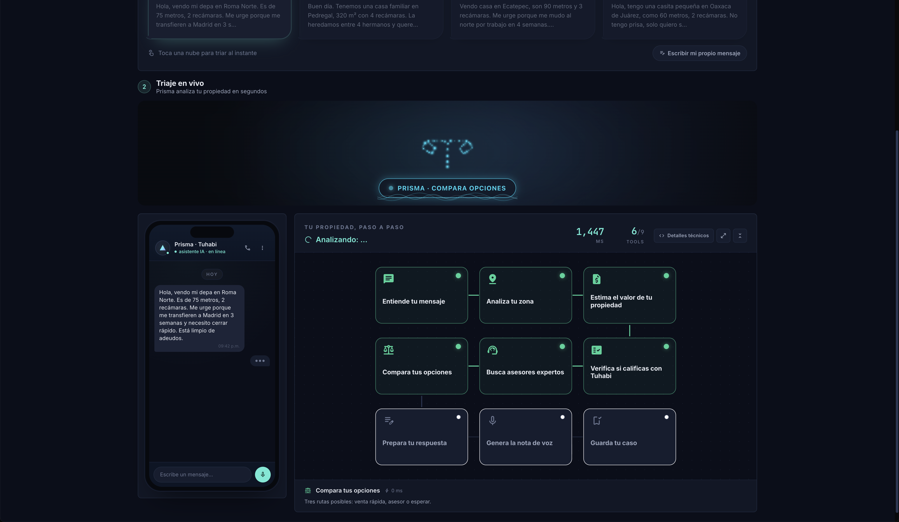
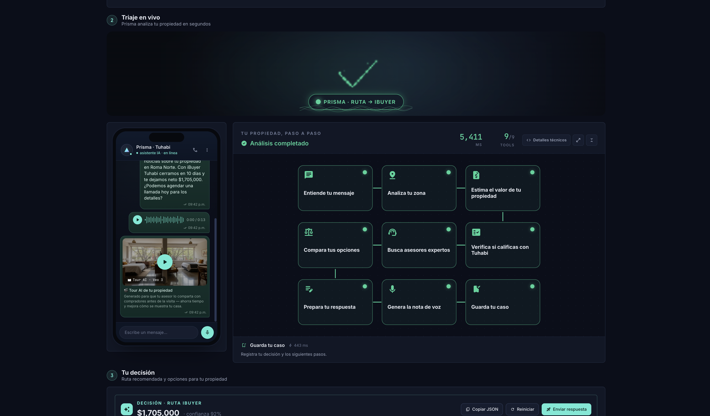
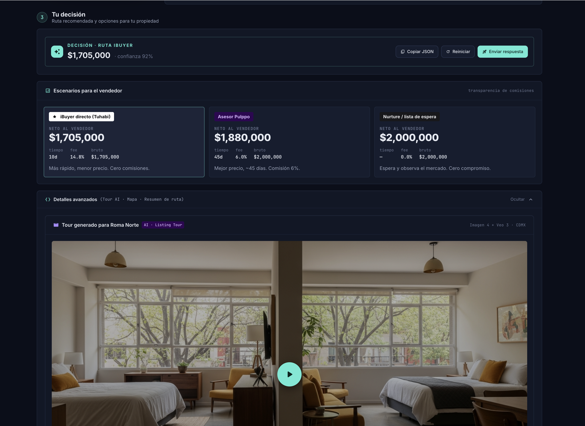

# Prisma

WhatsApp triage demo for Tuhabi. Routes a property seller to iBuyer, Pulppo, or nurture in about 30 seconds based on the first message they send, then sends back the recommended route and a fee breakdown as a voice note.

## How it looks

### Triage in progress



The seller picks one of the four message clouds. The particle visualizer at the top morphs into the shape of the tool that is currently running (here, the balance scale for `Compara opciones`). Each of the nine tool cards on the right lights its bubble green as the step completes. The WhatsApp mockup on the left shows the incoming message exactly as the seller sent it.

### Triage completed



When the agent finishes, the visualizer settles on a green check stroke and the status pill switches to the chosen route (`RUTA IBUYER` here). All nine tool bubbles are filled in. The WhatsApp mockup now contains the agent reply, a playable voice note, and the AI generated property tour. The decision card slides into view below.

### Decision and seller options



The decision panel shows the route, the net amount the seller takes home, and a confidence score. Below it are three side by side scenario cards (iBuyer, Pulppo asesor, Nurture), each with the seller's net, fee percentage, gross, time to close, and a one line tradeoff. The recommended card is highlighted. The advanced details collapsible holds the AI generated listing tour, the map, and any matched Pulppo brokers.

## Quick start

Requirements: Node 22 or newer, npm.

```
cp .env.local.example .env.local
# Open .env.local and fill in the keys listed below.
npm install
npm run dev
```

Open http://localhost:3000. Pick one of the four message clouds (Roma Norte, Pedregal, Ecatepec, Oaxaca) and the agent runs end to end. The Detalles tecnicos toggle in the chain header reveals tool names, providers, and raw outputs for engineering audiences.

## Environment variables

Required for the live triage path:

```
ANTHROPIC_API_KEY                       Server side. Drives the agent reasoning.
ELEVENLABS_API_KEY                      Server side. Generates the voice note.
ELEVENLABS_VOICE_ID_MX                  ElevenLabs voice id for Spanish output.
NEXT_PUBLIC_SUPABASE_URL                Public. Supabase project URL.
NEXT_PUBLIC_SUPABASE_PUBLISHABLE_KEY    Public. Browser side, RLS guarded.
SUPABASE_SECRET_KEY                     Server side. Writes triage decisions and uploads audio.
```

Optional:

```
NEXT_PUBLIC_APP_URL                     Set to the deployed URL after first deploy.
MAKE_WEBHOOK_TOKEN                      Bearer token for incoming Make.com calls.
TRIAGE_RATE_LIMIT_PER_HOUR              Per IP. Defaults to 10.
ANTHROPIC_MODEL_TRIAGE                  Overrides the default model.
```

The triage endpoint also accepts `?mock=1` to return a canned decision without calling Anthropic or ElevenLabs. Useful as a backup demo path or for testing without burning credits.

## Deploy on Vercel

1. Push this repo to GitHub.
2. In Vercel, import the repo. Root Directory is `/` (the app is at the repo root).
3. Paste the env vars from the table above into Project Settings. Mark every key labeled "server side" as Sensitive.
4. Deploy. The root URL serves the demo directly.

After the first deploy, set `NEXT_PUBLIC_APP_URL` to the live URL and redeploy.

## Project layout

```
app/                   Next.js routes. / serves the demo, /api/triage runs it.
components/prisma/     Header and listing tour card.
components/prisma-core/ Particle visualizer with per tool shape and color.
components/agent-flow/  React Flow node graph with the nine step chain.
components/whatsapp/   Phone mockup with text bubble, voice note, video tour.
lib/agent/             Triage agent, tools, prompts.
lib/shared/            Schemas, mock data, fee calculator.
scripts/               One off CLI helpers (voice preview, listing assets, smoke test).
supabase/migrations/   Database schema.
deck/                  Presentation slides and demo script.
```

## Rate limiting

The triage endpoint is capped at 10 calls per IP per rolling hour by default. Mock calls and authenticated Make.com server to server calls bypass the limit. Override with `TRIAGE_RATE_LIMIT_PER_HOUR`. See `lib/rate-limit.ts` for the implementation and notes on upgrading to durable Redis backed limiting.

## Demo materials

`deck/presentation.html` is the live slides. `deck/demo-script.md` is the 3 minute spoken script. `docs/demo-script-ecatepec.md` is the longer Ecatepec only script for a 3 person team.

## License

Private project, internal demo for Tuhabi. All rights reserved.
