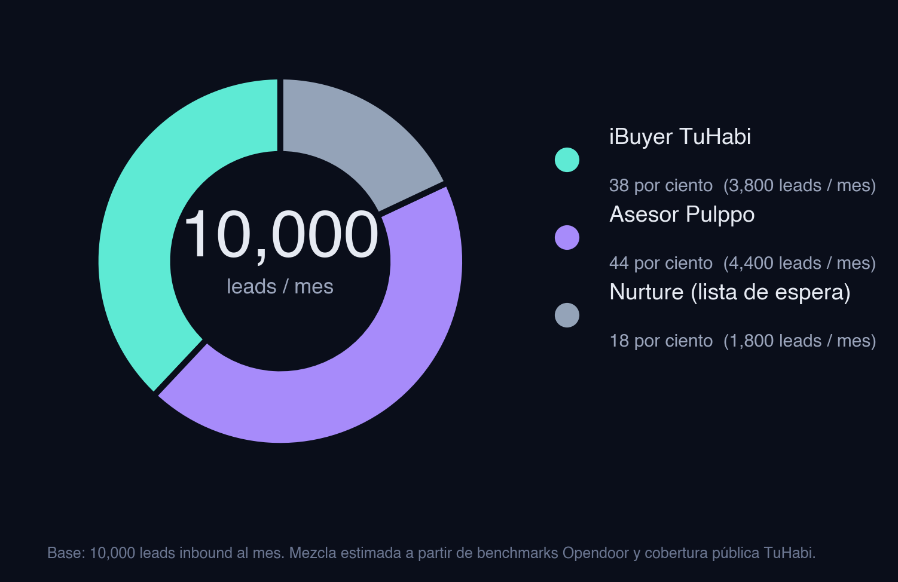
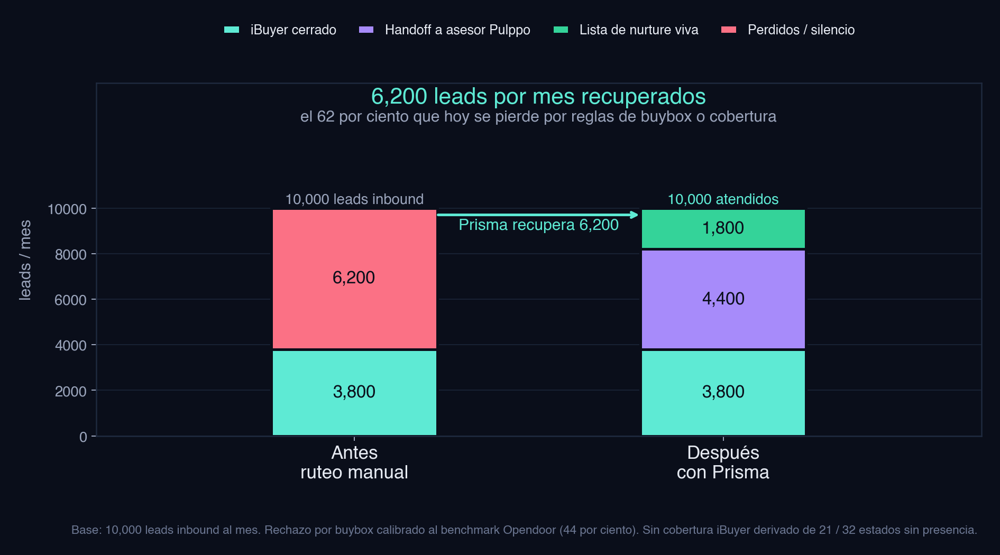
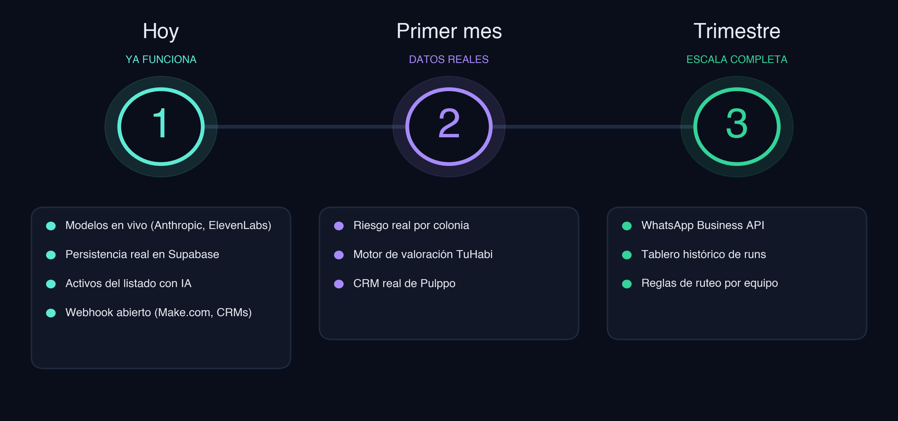

<!-- _class: title -->

# Prisma

## Centro de Triaje para TuHabi

Cada mensaje del vendedor en su mejor ruta, en menos de treinta segundos.

iBuyer directo, asesor Pulppo o nurture, con transparencia total de comisiones.

---

<!-- _class: divider -->

### El problema

# Hoy se gana mucho y se deja mucho en la mesa.

El motor iBuyer es tan estricto como debe ser.
Miles de vendedores caen fuera del buybox cada mes y muchos terminan en silencio.

---

<!-- _class: stats -->

# Por qué existe el hueco

  

    1B USD
    Transacciones combinadas TuHabi y Pulppo durante 2025. Buena base, el upside está en lo no capturado.
  

  

    11 / 32
    Estados con cobertura iBuyer. Veintiún estados quedan en blanco frente a la demanda inbound.
  

  

    0.5M a 4M MXN
    Rango de compra iBuyer. Pulppo promedia seis millones, así que hay una zona muerta entre los dos.
  

  

    40 a 60 por ciento
    Rango de rechazo benchmark en iBuyers grandes. Sobre TuHabi son entre diez y veinte mil leads al año.
  

  

    800 asesores
    Red Pulppo recién adquirida. Cada lead rechazado por iBuyer podría llegar a uno, hoy el ruteo es manual.
  

  

    100M USD
    Capital fresco H1 2026 dedicado a IA. El momento para mover esta palanca es ahora.
  

<strong>Fuentes:</strong> reportes públicos TuHabi y Pulppo 2025. Buybox y cobertura: página pública TuHabi. Rechazo iBuyer: reportes financieros Opendoor 2022 a 2024. Capital IA: cobertura BBVA Spark México H1 2026.

---

<!-- _class: divider -->

### La solución

# Un agente que enruta cada lead en menos de treinta segundos, sin perder ninguno.

Conversacional desde WhatsApp y canales similares.
Decide entre iBuyer, asesor Pulppo o nurture.
Explica los números al vendedor (neto, comisión, tiempo).
Persiste el lead en Supabase y se integra con cualquier CRM vía webhook.

---

<!-- _class: phases -->

# Cómo funciona Prisma

  

    FASE 1
    <h3>Entiende</h3>
    <ul>
      <li>Lee el mensaje en español de México</li>
      <li>Detecta zona y tipo de propiedad</li>
      <li>Estima urgencia y motivación</li>
    </ul>
  

  

    FASE 2
    <h3>Decide</h3>
    <ul>
      <li>Cruza zona contra capas de riesgo</li>
      <li>Estima valor y valida buybox</li>
      <li>Busca asesor Pulppo si aplica</li>
      <li>Calcula tres escenarios con netos</li>
    </ul>
  

  

    FASE 3
    <h3>Actúa</h3>
    <ul>
      <li>Responde con voz local</li>
      <li>Guarda lead y decisión en Supabase</li>
      <li>Se integra al CRM ya conectado</li>
    </ul>
  

<strong>Orquestador:</strong> un solo loop con Claude Haiku, bajo siete segundos por triaje. Make.com lo dispara desde cualquier canal.

---

<!-- _class: demo -->

### Ahora lo ven correr

# Demo en vivo

Cuatro mensajes reales. Cuatro rutas distintas. Una sola pantalla con la decisión siempre visible.

Cambiamos a la app. Volvemos a los slides en treinta segundos.

---

<!-- _class: chart -->

# Lo que acaban de ver, a escala

Casi la mitad de los leads termina en Pulppo, ruta que hoy queda en silencio. El resto se cierra como iBuyer o queda en nurture vivo.

Proporciones ilustrativas calibradas con el benchmark Opendoor de rechazo (44 por ciento) y la cobertura pública iBuyer de TuHabi (11 de 32 estados).

---

<!-- _class: chart -->

# La fuga, en una gráfica

Antes: solo el segmento dentro del buybox se cierra. Después: ningún lead se tira, cada uno aterriza en su mejor ruta posible.

Volúmenes ilustrativos sobre una base de 10,000 leads inbound al mes. Calibrados con benchmarks Opendoor y cobertura pública TuHabi.

---

<!-- _class: icp -->

# Cliente ideal

  

    PRIMARIO
    <h3>iBuyers híbridos</h3>
    
Compran cartera propia y a la vez tienen red de asesores. TuHabi y Pulppo son el caso uno a uno.

  

  

    ADYACENTE
    <h3>Proptechs con buybox rígido</h3>
    
Opendoor, Habi, Loft, La Haus. Cada vez que rechazan un lead pierden el costo de adquisición.

  

  

    FUTURO
    <h3>Brokerages digitales en LATAM</h3>
    
Volumen alto de leads inbound y equipos chicos. Prisma triaje + handoff levanta su capacidad sin contratar.

  

<strong>Señal de calce:</strong> más de 1,000 leads inbound al mes, regla de aceptación binaria, equipo humano que no escala al ritmo del marketing.

---

<!-- _class: team -->

# Por qué este equipo lo lleva a producción

  

    <h3>Daniel</h3>
    Arquitectura e implementación general
    
Diseñó el sistema y unió las piezas. Lleva sistemas con IA a producción.

  

  

    <h3>Joseph</h3>
    IA, animación y UI
    
Cuidó la voz visual y el storytelling del agente paso a paso.

  

  

    <h3>Braulio</h3>
    Fuentes de datos y validación
    
Tipa, valida y persiste cada dato. Decisión trazable, no caja negra.

  

  

    <h3>Roberto</h3>
    Orquestación del agente
    
Montó el loop de herramientas y el caching de prompts. Costo bajo control.

  

  

    <h3>Denisse</h3>
    Handoff, voz y cierre
    
Conecta a asesor, voz en español MX y persistencia. Cierra el ciclo.

  

  

    Razonamiento
    Anthropic Claude Haiku 4.5 + prompt cache
  

  

    Visión y extracción
    Google Gemini 2.5
  

  

    Cover del listing
    Google Imagen 4
  

  

    Tour del listing
    Google Veo 3 (image to video)
  

  

    Voz local MX
    ElevenLabs (voz Sofía)
  

  

    Datos y orquestación
    Supabase + Make.com + Next.js 16
  

---

<!-- _class: timeline -->

# Cómo llegamos al mercado

Día uno: piloto con TuHabi y Pulppo. Primer mes: datos reales conectados. Trimestre: WhatsApp Business y tablero histórico.

---

<!-- _class: split -->

# Qué pasa el lunes

### Equipo de adquisición

- Los nuevos mensajes llegan ya triados
- El equipo solo revisa los listos para llamar
- Los rechazos por buybox se vuelven inicio de la ruta Pulppo
- Cero leads tirados al cierre del día

### Asesores Pulppo

- Reciben leads tibios, no fríos
- Cada handoff trae contexto y valor estimado
- Borrador de mensaje inicial listo para enviar
- Métricas de desempeño por zona y por asesor

---

<!-- _class: close -->

# Prisma

## Cada mensaje del vendedor en su mejor ruta.

Sin lead perdido. Sin asesor improvisando. Sin vendedor a ciegas.
Listo para correr el lunes.
